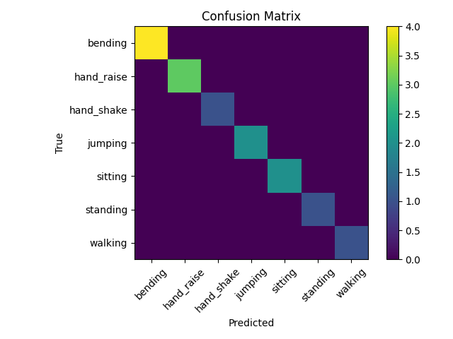

# Real-Time Human Activity Recognition (HAR) using LSTM


**AI & Robotics - Final Project**

This project implements a lightweight, real-time Human Activity Recognition system tailored for robotic control interfaces and edge devices. It utilizes **Google MediaPipe** for privacy-preserving skeleton extraction and a **Long Short-Term Memory (LSTM)** neural network for temporal sequence classification.

## 📌 Project Overview
The system captures video input (webcam), extracts 33 distinctive body landmarks in real-time, and classifies the movement into one of 7 categories. Unlike computationally expensive RGB-based methods (like 3D-CNNs), this approach relies on geometric pose coordinates, enabling high-speed inference on standard CPUs.

### Supported Activities
The model is trained to recognize the following 7 classes:
1. **Bending**
2. **Hand Raise** 
3. **Hand Shake**
4. **Jumping**
5. **Sitting**
6. **Standing**
7. **Walking**

## 🏗 System Architecture
The pipeline consists of three main stages:
1. **Pose Estimation:** Extracting $(x, y)$ coordinates using MediaPipe Pose.
2. **Preprocessing:** Normalizing coordinates and creating sliding windows ($T=30$ frames).
3. **Inference:** Predicting the action class using a stacked LSTM model.


*(Figure 1: Confusion Matrix / System Flow)*

## 🚀 Installation & Setup

1. **Clone the repository:**
   ```bash
   git clone [https://github.com/zeynepsoyuk/realtime-har-lstm.git](https://github.com/zeynepsoyuk/realtime-har-lstm.git)
   cd realtime-har-lstm

2. **Install Dependencies:**
    ```bash
    pip install -r requirements.txt

## 🛠 Usage

1. **Data Collection (Optional)**
To record new movements for training:
    ```bash
    python collect_pose_data.py
    # Note: Update the 'ACTIVITY_NAME' variable in the script before recording.

2. **Training the Model**
To process the CSV data and train the LSTM network:
    ```bash
    python create_sequences.py  # Converts CSV logs to Numpy sequences
    python train_lstm.py        # Trains the model and saves 'activity.h5'

3. **Real-Time Testing (Demo)**
To run the live recognition system using your webcam:
    ```bash
    python train_lstm.py 
    # (Or run the inference script if separated)

## 📊 Model Performance

    *Accuracy: 100% on Test Set*

    *Architecture: LSTM (64 units) -> Dropout (0.3) -> LSTM (32 units) -> Dense (7)*

    *Input Shape: (30 frames, 66 landmarks)*

 ##   📂 File Structure

realtime-har-lstm/
├── dataset/             # Raw CSV data containing landmark logs
├── sequences/           # Preprocessed Numpy arrays for training
├── collect_pose_data.py # Script for recording pose landmarks
├── create_sequences.py  # Data preprocessing and windowing script
├── train_lstm.py        # Main script for model training and evaluation
├── requirements.txt     # List of required Python libraries
└── README.md            # Project documentation

## 📜 License
This project is licensed under the MIT License.